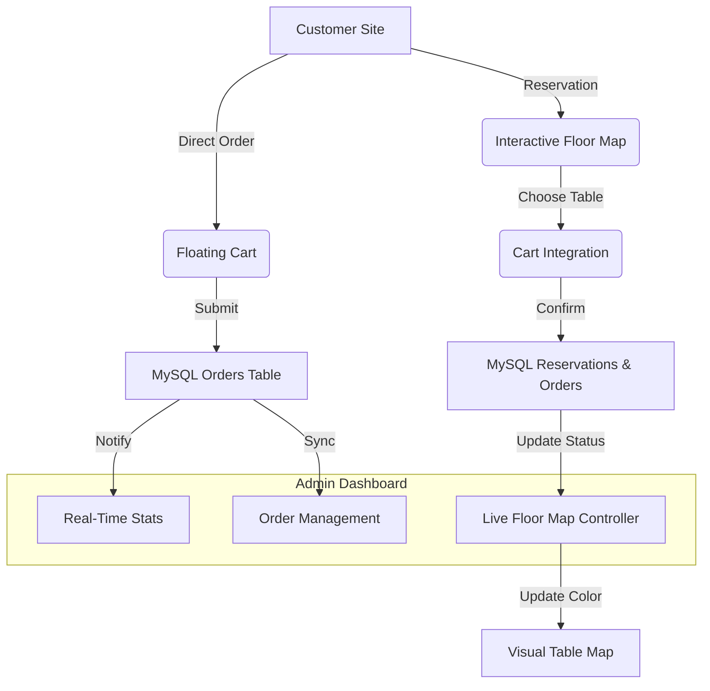

# ☕ Café Aroma — Artisan Coffee & Fine Pastries

**Elevating the coffee experience through modern technology.**

Café Aroma is a world-class café management and ordering ecosystem. It bridges the gap between artisan craftsmanship and digital efficiency, featuring a high-performance customer interface and an advanced, data-driven administrative command center.

---

## ✨ Features & Capabilities

### 📱 Customer Digital Experience
- **Interactive Menu:** A high-end visual menu with real-time category filtering (Coffee, Tea, Pastries, etc.) and smooth card entrance animations.
- **Direct Express Checkout:** A custom **Floating Cart** solution. Customers can order instantly for pickup/takeaway without the need for a formal table booking.
- **Visual Reservation Engine:** A premium 3-step checkout:
  1. **Visual Table Selection:** See the café's floor plan and pick your favorite spot.
  2. **Reservation Metrics:** Define party size and precise timing.
  3. **Cart Integration:** Add food and drinks to your reservation for instant service upon arrival.

### 💼 Admin Command Center
- **Animated Dashboard:** A smooth, interactive experience with staggered entrance animations for all control panels.
- **Live Floor Map:** A "graphical" bird's-eye view of your café floor.
  - **Dynamic Status:** Tables turn **Red** when booked and return to **Green** once completed.
  - **Visual Timing:** The **Table Number** and **Booking Time** are displayed directly on the table icons for glanceable management.
  - **Hover Tooltips:** Hover over any table to see the specific customer name and order details.
- **Real-Time Data Pipeline:** A high-speed connection between the database and the dashboard ensures statistics (Revenue, Orders, Bookings) stay accurate to the second.

---

## 🔄 System Workflow & Explanation



### How it Works:
1.  **Order Submission:** Every action (Order/Reservation) creates record in the MySQL database.
2.  **Dashboard Sync:** The admin dashboard polls the server (or uses the refresh trigger) to pull the latest state of all tables.
3.  **Visualization:** The logic calculates if a table is "Active" for the current date and time, dynamically switching its color and injecting the booking time into the map element.

---

## 🚀 Setup & Launch

### 1. Requirements
- Node.js (Latest LTS)
- MySQL Workbench

### 2. Quick Setup
```bash
# Clone and install
git clone https://github.com/sarthakmohitesm/cafe.git
cd cafe
npm install

# Start development server
npm start
```
- **Public Site:** `http://localhost:3000`
- **Admin App:** `http://localhost:3000/admin.html` (Login: `admin` / `admin123`)

---

Developed with precision by the **Antigravity AI Coding Assistant**.
