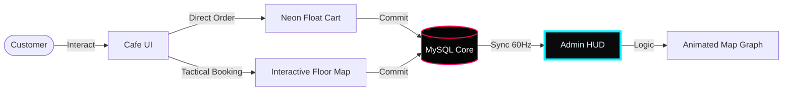

# 🌌 [V1.2] CAFÉ AROMA: CYBER-ARTISAN PROTOCOL

> **Status:** Online
> **Environment:** Neon-Grid Optimized
> **Protocol:** Cafe Management & Rapid Deployment

---

## ⚡ SYSTEM OVERVIEW (THE HUD)

**CAFÉ AROMA** is not just a website; it's a high-performance **Operating Environment** for artisan coffee. Designed with a **Cyberpunk Gaming Aesthetic**, it features a real-time reactive interface for both customers and operators.

### 🕹️ CUSTOMER HUD (FRONT-END)
- **NEON MENU:** Rapid filtering with zero-latency category switching.
- **CYBER-CART:** A floating, state-of-the-art order relay system.
- **TACTICAL BOOKING:** Visual table selection integrated with the main ordering pipeline.

### 🛡️ OPERATOR COMMAND (ADMIN DASHBOARD)
- **HUD OVERLAY:** A full-screen admin interface with **Scanline Effects** and **CRT CRT Flicker**.
- **LIVE FLOOR GRID:** A real-time spatial map of the arena.
  - **HOSTILE/BOOKED:** Tables pulse in **Laser Red** (#FF0055) when occupied.
  - **IDLE/AVAILABLE:** Tables glow in **Neon Cyan** (#00F3FF) when ready.
- **DATA RELAY:** Live telemetry for Revenue, Orders, and Terminal status.

---

## 🛠️ TECH SPECS [HARDWARE & SOFTWARE]

- **CORE ENGINE:** Node.js [v18+]
- **DATA STORAGE:** MySQL [Protocol 8.0]
- **INTERFACE:** Vanilla CSS3 [Neon Design System]
- **LOGIC:** ES6+ JavaScript [Asynchronous Flow]

---

## 🔄 THE FLOW [SYSTEM TELEMETRY]



---

## 🚀 DEPLOY PROTOCOL

```bash
# ACTIVATE ENVIRONMENT
git clone https://github.com/sarthakmohitesm/cafe.git
cd cafe

# INSTALL MODULES
npm i

# INITIAL_BOOT
npm start
```

---

**[ACCESS GRANTED]**
*Developed by the Antigravity AI Sub-Protocol.*
