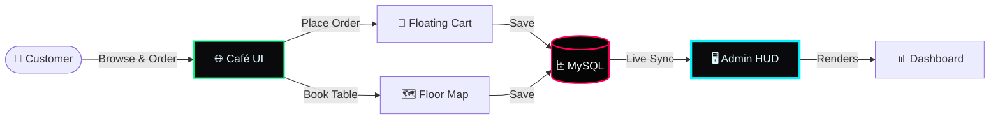

<div align="center">

```
░█▀▀░█▀█░█▀▀░█▀▀░░░█▀█░█▀▄░█▀█░█▄█░█▀█
░█░░░█▀█░█▀▀░█▀▀░░░█▀█░█▀▄░█░█░█░█░█▀█
░▀▀▀░▀░▀░▀░░░▀▀▀░░░▀░▀░▀░▀░▀▀▀░▀░▀░▀░▀
```

**CYBER-ARTISAN PROTOCOL · V1.2**

[](https://github.com/sarthakmohitesm/cafe)
[](https://github.com/sarthakmohitesm/cafe)
[](https://nodejs.org)
[](https://mysql.com)
[](LICENSE)

*A full-stack café management system — order food, book tables, and manage everything from a live admin dashboard.*

</div>

---

## 🌐 What is Café Aroma?

**Café Aroma** is a complete web application for running a café. It has two sides:

- **Customer side** — browse the menu, add items to a cart, and book a table visually.
- **Admin side** — a live dashboard where staff can see all orders, reservations, and revenue in real time.

No mobile app needed. No third-party platform. Just clone, configure, and run.

---

## ✨ Features

### 🕹️ Customer Interface
| Feature | What it does |
|---|---|
| ⚡ **Neon Menu** | Browse menu items with instant category filtering — no page reload |
| 🛒 **Floating Cart** | Add items to a persistent cart that stays visible while you browse |
| 📍 **Table Booking** | Pick your table from a live visual floor map and book it in seconds |

### 🛡️ Admin Dashboard
| Feature | What it does |
|---|---|
| 📊 **Live Stats** | Real-time revenue, pending orders, and total customers served |
| 🗺️ **Floor Grid** | Visual map showing which tables are free 🟦 or occupied 🟥 |
| 📋 **Order Management** | Update order status (Pending → Preparing → Ready → Completed) |
| 📅 **Reservations** | View and manage all table bookings with one click |

---

## 🛠️ Tech Stack

| Layer | Technology |
|---|---|
| **Backend** | Node.js (v18+) + Express.js |
| **Database** | MySQL 8.0 |
| **Frontend** | HTML · CSS3 · Vanilla JavaScript (ES6+) |
| **Auth** | JWT (JSON Web Tokens) |

> No React, no Angular — just clean, fast Vanilla JS that runs anywhere.

---

## 🔄 How It Works



---

## 🚀 Getting Started

Follow these steps in order. You'll have the app running in under 5 minutes.

### ✅ Prerequisites

Make sure you have these installed before starting:

- [Node.js v18+](https://nodejs.org/en/download) — the server runtime
- [MySQL 8.0](https://dev.mysql.com/downloads/mysql/) — the database
- [Git](https://git-scm.com/downloads) — to clone the project

---

### Step 1 — Clone the Repository

```bash
git clone https://github.com/sarthakmohitesm/cafe.git
cd cafe
```

---

### Step 2 — Install Dependencies

```bash
npm install
```

This installs all required packages listed in `package.json`.

---

### Step 3 — Set Up the Database

Open MySQL and create a database:

```sql
CREATE DATABASE cafe_aroma;
```

Then import the schema (tables & sample data):

```bash
mysql -u root -p cafe_aroma < database/schema.sql
```

---

### Step 4 — Configure Environment Variables

Create a `.env` file in the root folder:

```bash
cp .env.example .env
```

Then open `.env` and fill in your details:

```env
# Database connection
DB_HOST=localhost
DB_USER=root
DB_PASSWORD=your_mysql_password
DB_NAME=cafe_aroma

# Server
PORT=3000

# Admin auth (change this to something secret)
JWT_SECRET=your_secret_key_here
```

---

### Step 5 — Start the Server

```bash
npm start
```

The app will be live at:

```
http://localhost:3000          ← Customer interface
http://localhost:3000/admin    ← Admin dashboard
```

> **Default admin login:** `admin` / `admin123` — change this before going live.

---

## 📁 Project Structure

```
cafe/
├── public/
│   ├── index.html          # Customer-facing menu & booking page
│   ├── admin.html          # Admin dashboard
│   └── style.css           # Shared styles
│
├── routes/
│   ├── menu.js             # Menu API — fetch items & categories
│   ├── orders.js           # Orders API — create & track orders
│   ├── reservations.js     # Booking API — create & manage bookings
│   └── admin.js            # Admin API — stats, status updates, auth
│
├── db.js                   # MySQL connection setup
├── server.js               # Main Express server entry point
├── .env.example            # Environment variable template
└── package.json
```

---

## 🔌 API Reference

| Method | Route | Description |
|---|---|---|
| `GET` | `/api/menu` | Get all menu items |
| `POST` | `/api/orders` | Place a new order |
| `POST` | `/api/reservations` | Make a table reservation |
| `POST` | `/api/admin/login` | Admin login → returns JWT |
| `GET` | `/api/admin/stats` | Live revenue & order counts |
| `GET` | `/api/admin/orders` | All orders list |
| `PUT` | `/api/admin/orders/:id/status` | Update an order's status |
| `GET` | `/api/admin/reservations` | All reservations list |
| `PUT` | `/api/admin/reservations/:id/status` | Update a reservation's status |

---

## ❓ Common Issues

**MySQL connection refused**
> Make sure MySQL is running: `sudo service mysql start` (Linux) or start it via MySQL Workbench (Windows/Mac).

**Port 3000 already in use**
> Change `PORT=3000` to any free port (e.g. `3001`) in your `.env` file.

**`npm install` fails**
> Verify your Node version is 18+: `node --version`

---

## 🤝 Contributing

Pull requests are welcome! For major changes, please open an issue first to discuss what you'd like to change.

---

<div align="center">

---

**`[ ACCESS GRANTED ]`**

Made with ☕ by [Sarthak Mohite](https://github.com/sarthakmohitesm)

*CAFÉ AROMA · CYBER-ARTISAN PROTOCOL · V1.2 · ALL SYSTEMS NOMINAL*

</div>